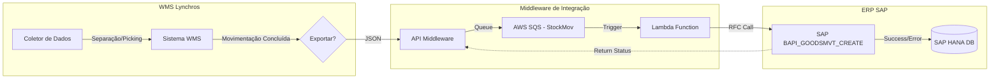

## Oportunidade
Falta de sincronia em tempo real entre o faturamento e a operação de armazém, causando divergências de estoque.

## Solução
Desenvolvimento de um Middleware em **C# (.NET Framework)** utilizando microserviços e mensageria (**AWS SQS**) para garantir resiliência nas transações.

## Trade-off
Implementação de **Consistência Eventual**. Aceitamos um atraso milimétrico na sincronia em troca de uma operação que nunca trava, mesmo se o SAP oscilar.

## Resultados
*   **99.9%** de acuracidade no estoque.
*   **-30%** no tempo de expedição.
*   Alta resiliência operacional.

## Fluxo de Integração


```
