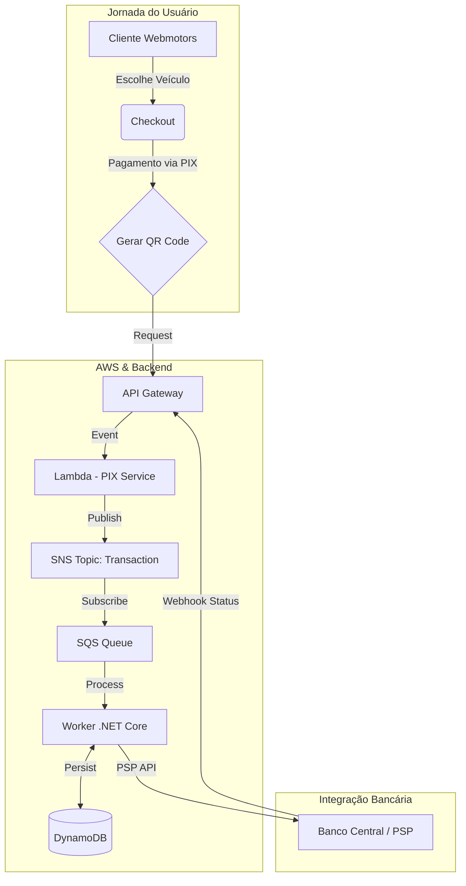

## Oportunidade
Necessidade de reduzir dependência de boletos (baixa liquidez) e taxas de cartão.

## Solução
Jornada de pagamento PIX integrada ao checkout e faturamento em sistema legados, utilizando **C#** e arquitetura baseada em eventos (**Event-Driven**).
Utilização do Gateway **Pagar.me** e da solução de PIX do **Santander** como contigenciamento.

## Trade-off
Foco em **Idempotência**. Implementamos travas rigorosas na cadeia de eventos para evitar bitributação ou liberações duplicadas em cenários de instabilidade de rede. Adoção de contingenciamento com taxa superior para evitar indisponibilidade de serviço.

## Resultados
Adoção de **40% das transações** no primeiro mês e liquidez imediata.
*   **R$ 75 bi/ano** processados (TPV).
*   **Zero downtime** durante Black Friday.

## Fluxo e Arquitetura


```
